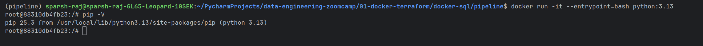
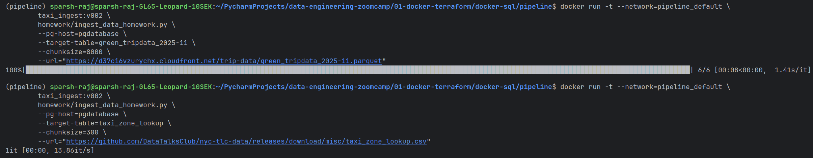
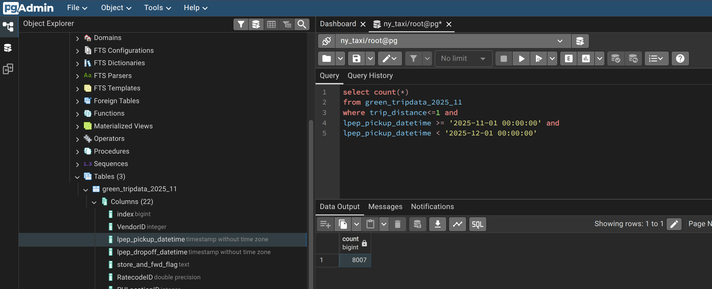
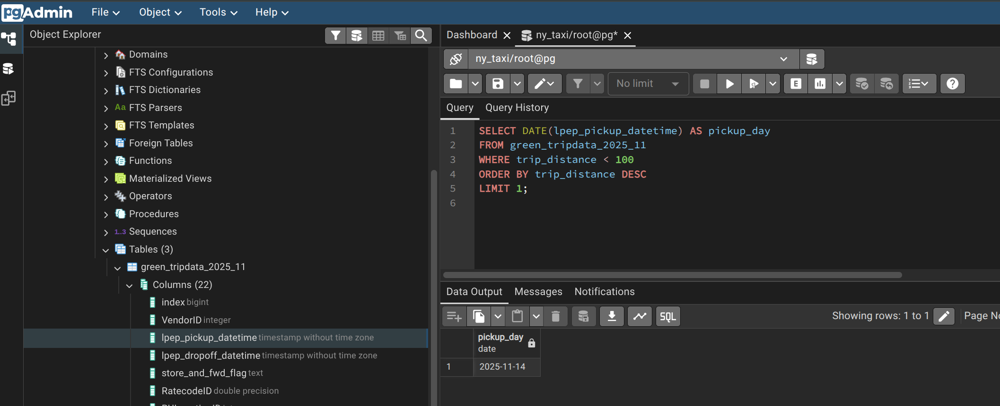
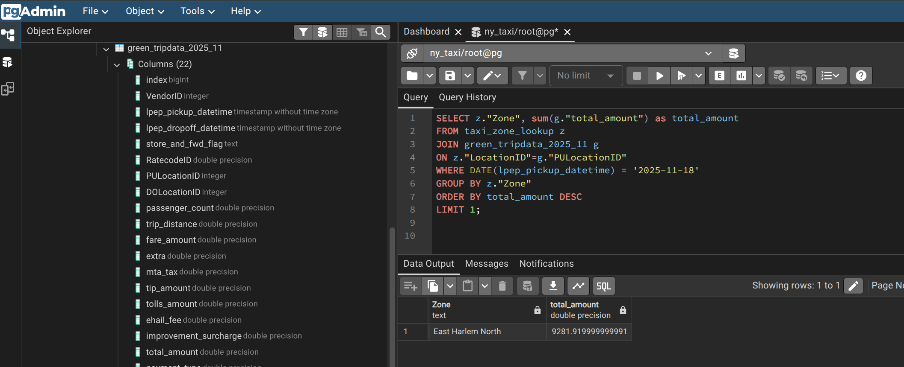
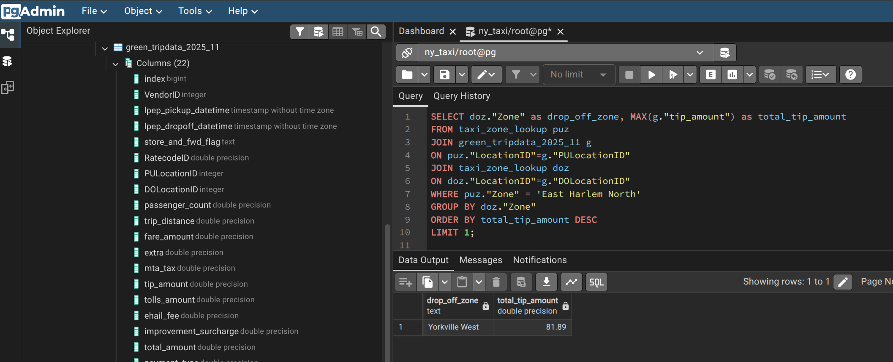

# Module 1 Homework: Docker & SQL

In this homework we'll prepare the environment and practice
Docker and SQL

When submitting your homework, you will also need to include
a link to your GitHub repository or other public code-hosting
site.

This repository should contain the code for solving the homework.

When your solution has SQL or shell commands and not code
(e.g. python files) file format, include them directly in
the README file of your repository.


## Question 1. Understanding Docker images

Run docker with the `python:3.13` image. Use an entrypoint `bash` to interact with the container.

What's the version of `pip` in the image?

- 25.3
- 24.3.1
- 24.2.1
- 23.3.1

### Solution
```bash
docker run -it --entrypoint bash python:3.13
pip --V
```
Output: `pip 25.3 from /usr/local/lib/python3.13/site-packages/pip (python 3.13)`


Answer: 25.3

## Question 2. Understanding Docker networking and docker-compose

Given the following `docker-compose.yaml`, what is the `hostname` and `port` that pgadmin should use to connect to the postgres database?

```yaml
services:
  db:
    container_name: postgres
    image: postgres:17-alpine
    environment:
      POSTGRES_USER: 'postgres'
      POSTGRES_PASSWORD: 'postgres'
      POSTGRES_DB: 'ny_taxi'
    ports:
      - '5433:5432'
    volumes:
      - vol-pgdata:/var/lib/postgresql/data

  pgadmin:
    container_name: pgadmin
    image: dpage/pgadmin4:latest
    environment:
      PGADMIN_DEFAULT_EMAIL: "pgadmin@pgadmin.com"
      PGADMIN_DEFAULT_PASSWORD: "pgadmin"
    ports:
      - "8080:80"
    volumes:
      - vol-pgadmin_data:/var/lib/pgadmin

volumes:
  vol-pgdata:
    name: vol-pgdata
  vol-pgadmin_data:
    name: vol-pgadmin_data
```

- postgres:5433
- localhost:5432
- db:5433
- postgres:5432
- db:5432

If multiple answers are correct, select any_ 

### Solution
The `hostname` is the name of the service defined in the `docker-compose.yaml`, which is `db`.
The `port` is the internal port of the Postgres container, which is `5432`.
Answer: db:5432

## Prepare the Data

Download the green taxi trips data for November 2025:

```bash
wget https://d37ci6vzurychx.cloudfront.net/trip-data/green_tripdata_2025-11.parquet
```

You will also need the dataset with zones:

```bash
wget https://github.com/DataTalksClub/nyc-tlc-data/releases/download/misc/taxi_zone_lookup.csv
```

`Load the data into your Postgres database`
- Updated Dockerfile in the `pipeline` folder to include `homework/ingest_data_homework.py`:
```dockerfile
# Start with slim Python 3.13 image
FROM python:3.13.10-slim

# Copy uv binary from official uv image (multi-stage build pattern)
COPY --from=ghcr.io/astral-sh/uv:latest /uv /bin/

# Set working directory
WORKDIR /app

# Add virtual environment to PATH so we can use installed packages
ENV PATH="/app/.venv/bin:$PATH"

# Copy dependency files first (better layer caching)
COPY "pyproject.toml" "uv.lock" ".python-version" ./
# Install dependencies from lock file (ensures reproducible builds)
RUN uv sync --locked

# Copy application code
COPY ingest_data.py ingest_data.py
COPY homework/ingest_data_homework.py homework/ingest_data_homework.py

# Set entry point
ENTRYPOINT ["python"]
CMD ["ingest_data.py"]
```
- Build the image with tag `taxi_ingest:v002`
```bash
docker build -t taxi_ingest:v002 .
```
```bash
docker run -t --network=pipeline_default \
        taxi_ingest:v002 \
        homework/ingest_data_homework.py \
        --pg-host=pgdatabase \
        --target-table=green_tripdata_2025_11 \
        --chunksize=8000 \
        --url="https://d37ci6vzurychx.cloudfront.net/trip-data/green_tripdata_2025-11.parquet"
```
```bash
docker run -t --network=pipeline_default \
        taxi_ingest:v002 \
        homework/ingest_data_homework.py \
        --pg-host=pgdatabase \
        --target-table=taxi_zone_lookup \
        --chunksize=300 \
        --url="https://github.com/DataTalksClub/nyc-tlc-data/releases/download/misc/taxi_zone_lookup.csv"
```

## Question 3. Counting short trips

For the trips in November 2025 (lpep_pickup_datetime between '2025-11-01' and '2025-12-01', exclusive of the upper bound), how many trips had a `trip_distance` of less than or equal to 1 mile?

- 7,853
- 8,007
- 8,254
- 8,421

### Answer
```sql
select count(*)
from green_tripdata_2025_11
where trip_distance<=1 and
    lpep_pickup_datetime >= '2025-11-01 00:00:00' and
    lpep_pickup_datetime < '2025-12-01 00:00:00'
```
Output: 
Answer: 8,007
## Question 4. Longest trip for each day

Which was the pick up day with the longest trip distance? Only consider trips with `trip_distance` less than 100 miles (to exclude data errors).

Use the pick up time for your calculations.

- 2025-11-14
- 2025-11-20
- 2025-11-23
- 2025-11-25

### Answer
```sql
SELECT DATE(lpep_pickup_datetime) AS pickup_day
FROM green_tripdata_2025_11
WHERE trip_distance < 100
ORDER BY trip_distance DESC
LIMIT 1;
```
Output: 
Answer: 2025-11-14

## Question 5. Biggest pickup zone

Which was the pickup zone with the largest `total_amount` (sum of all trips) on November 18th, 2025?

- East Harlem North
- East Harlem South
- Morningside Heights
- Forest Hills

### Answer
```sql
SELECT z."Zone", sum(g."total_amount") as total_amount
FROM taxi_zone_lookup z
         JOIN green_tripdata_2025_11 g
              ON z."LocationID"=g."PULocationID"
WHERE DATE(lpep_pickup_datetime) = '2025-11-18'
GROUP BY z."Zone"
ORDER BY total_amount DESC
    LIMIT 1;
```
Output: 

Answer: East Harlem North
## Question 6. Largest tip

For the passengers picked up in the zone named "East Harlem North" in November 2025, which was the drop off zone that had the largest tip?

Note: it's `tip` , not `trip`. We need the name of the zone, not the ID.

- JFK Airport
- Yorkville West
- East Harlem North
- LaGuardia Airport

### Answer
```sql
SELECT doz."Zone" as drop_off_zone, MAX(g."tip_amount") as total_tip_amount
FROM taxi_zone_lookup puz
         JOIN green_tripdata_2025_11 g
              ON puz."LocationID"=g."PULocationID"
         JOIN taxi_zone_lookup doz
              ON doz."LocationID"=g."DOLocationID"
WHERE puz."Zone" = 'East Harlem North'
GROUP BY doz."Zone"
ORDER BY total_tip_amount DESC
    LIMIT 1;
```
Output: 

Answer: Yorkville West

## Terraform

In this section homework we'll prepare the environment by creating resources in GCP with Terraform.

In your VM on GCP/Laptop/GitHub Codespace install Terraform.
Copy the files from the course repo
[here](../../../01-docker-terraform/terraform/terraform) to your VM/Laptop/GitHub Codespace.

Modify the files as necessary to create a GCP Bucket and Big Query Dataset.


## Question 7. Terraform Workflow

Which of the following sequences, respectively, describes the workflow for:
1. Downloading the provider plugins and setting up backend,
2. Generating proposed changes and auto-executing the plan
3. Remove all resources managed by terraform`

Answers:
- terraform import, terraform apply -y, terraform destroy
- teraform init, terraform plan -auto-apply, terraform rm
- terraform init, terraform run -auto-approve, terraform destroy
- terraform init, terraform apply -auto-approve, terraform destroy
- terraform import, terraform apply -y, terraform rm

### Answer
Answer: terraform init, terraform apply -auto-approve, terraform destroy

## Submitting the solutions

* Form for submitting: https://courses.datatalks.club/de-zoomcamp-2026/homework/hw1


## Learning in Public

We encourage everyone to share what they learned. This is called "learning in public".

### Why learn in public?

- Accountability: Sharing your progress creates commitment and motivation to continue
- Feedback: The community can provide valuable suggestions and corrections
- Networking: You'll connect with like-minded people and potential collaborators
- Documentation: Your posts become a learning journal you can reference later
- Opportunities: Employers and clients often discover talent through public learning

You can read more about the benefits [here](https://alexeyondata.substack.com/p/benefits-of-learning-in-public-and).

Don't worry about being perfect. Everyone starts somewhere, and people love following genuine learning journeys!

### Example post for LinkedIn

```
🚀 Week 1 of Data Engineering Zoomcamp by @DataTalksClub complete!

Just finished Module 1 - Docker & Terraform. Learned how to:

✅ Containerize applications with Docker and Docker Compose
✅ Set up PostgreSQL databases and write SQL queries
✅ Build data pipelines to ingest NYC taxi data
✅ Provision cloud infrastructure with Terraform

Here's my homework solution: <LINK>

Following along with this amazing free course - who else is learning data engineering?

You can sign up here: https://github.com/DataTalksClub/data-engineering-zoomcamp/
```

### Example post for Twitter/X


```
🐳 Module 1 of Data Engineering Zoomcamp done!

- Docker containers
- Postgres & SQL
- Terraform & GCP
- NYC taxi data pipeline

My solution: <LINK>

Free course by @DataTalksClub: https://github.com/DataTalksClub/data-engineering-zoomcamp/
```


